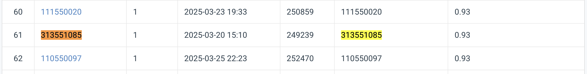
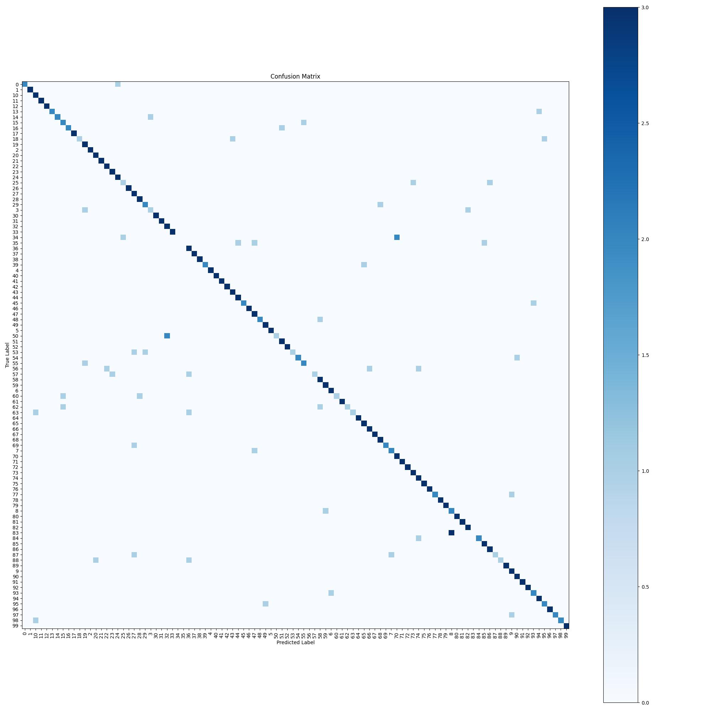
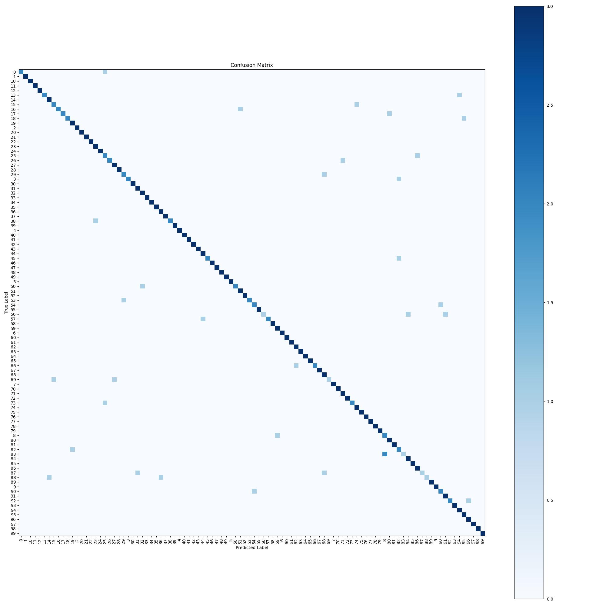

# NYCU Visual Recognition Deep Learning 2025 Homework 1
Student ID: 313551085  
Name: 謝振杰

## Introduction
This repository provides implementations for image classification using two popular deep learning architectures: **ResNet** and **ResNeSt**. The project is built using PyTorch and includes separate scripts for both training and inference:

- **Training Scripts:**  
  - `resnet_train.py` for training a ResNet-based model  
  - `resnest_train.py` for training a ResNeSt-based model

- **Inference Scripts:**  
  - `resnet_inference.py` for generating predictions with a ResNet-based model  
  - `resnest_inference.py` for generating predictions with a ResNeSt-based model

Key features of the project include:
- **Advanced Data Augmentation:** Supports techniques such as random crops, rotations, color jittering, mixup, and random erasing.
- **Performance Evaluation:** Provides utilities to generate predictions and plot confusion matrices.
- **TensorBoard Integration:** Logs training progress and hyperparameters for detailed monitoring.
- **Flexible Model Customization:** Easily adjust model architecture (e.g., dropout, fine-tuning options) and training hyperparameters.

This project is designed for both research and production environments, offering a modular and easy-to-adapt framework for experimenting with different network architectures on your custom dataset.

## Installation
Follow these steps to set up the project on your local machine:

0. **Dev Container:**  
    This project has a VSCode dev container configuration attached. It's recommended to run this project inside dev container.
1. **Install Dependencies:**
   ```bash
   pip install -r requirements.txt
   ```
   Make sure that you have installed the correct version of PyTorch. For GPU acceleration, verify that CUDA is available on your system.

4. **Prepare Your Dataset:**
   Organize your data into the following structure:
   ```
   dataset/
   ├── train/
   │   ├── class1/
   │   └── class2/
   ├── val/
   │   ├── class1/
   │   └── class2/
   └── test/
       ├── image1.jpg
       ├── image2.jpg
       └── ...
   ```
   The training and validation folders should have subdirectories for each class, while the test folder should contain only the image files.

## Performance Snapshot
### Leaderboard Score:  
The ResNeSt101 model get a 0.93 accuracy in the leaderboard


### **ResNet Model:**  
  - Top-1 Accuracy on validation set: *89%*  
  - Confusion Matrix: 

### **ResNeSt Model:**  
  - Top-1 Accuracy on validation set: *92%*  
  - Confusion Matrix: 

Feel free to expand this section with additional evaluation metrics, training curves, or comparisons between the two architectures.

## Usage
### Training
Run the training scripts with the appropriate command-line arguments:

- **ResNet Training:**
  ```bash
  python resnet_train.py --train-dir /path/to/train --val-dir /path/to/val --test-dir /path/to/test --exp-name exp_resnet --epochs 60 --batch-size 256 --lr 0.01
  ```

- **ResNeSt Training:**
  ```bash
  python resnest_train.py --train-dir /path/to/train --val-dir /path/to/val --test-dir /path/to/test --exp-name exp_resnest --epochs 60 --batch-size 256 --lr 0.001
  ```

### Inference
To generate predictions and evaluate your model, use the corresponding inference scripts:

- **ResNet Inference:**
  ```bash
  python resnet_inference.py --model-path /path/to/best_model.pth --train-dir /path/to/train --val-dir /path/to/val --test-dir /path/to/test --batch-size 256
  ```

- **ResNeSt Inference:**
  ```bash
  python resnest_inference.py --weights /path/to/weights.pth --val-dir /path/to/val --test-dir /path/to/test --batch-size 256
  ```

### Analysis Notebook
The `analyze.ipynb` notebook provides a simple, interactive environment to explore and visualize the performance of the trained models.

## Homework Report
For detailed homework report, please visit: https://hackmd.io/tnFseawtSD6SL3--RlnITg